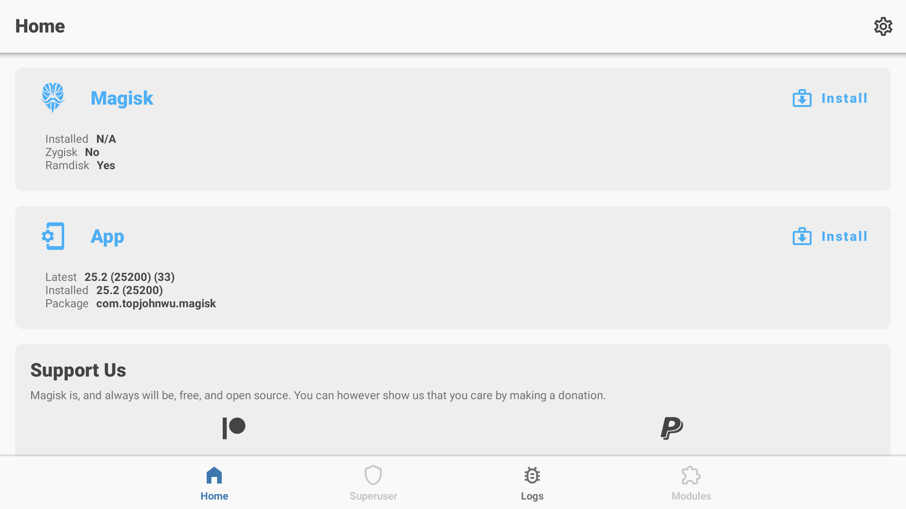
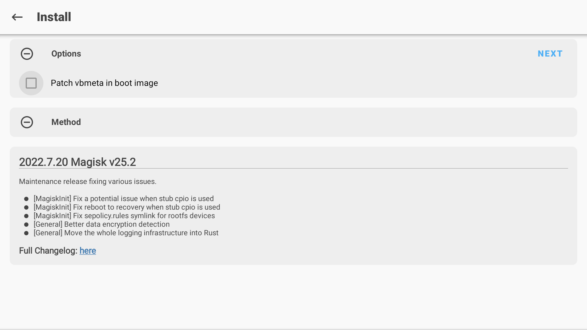
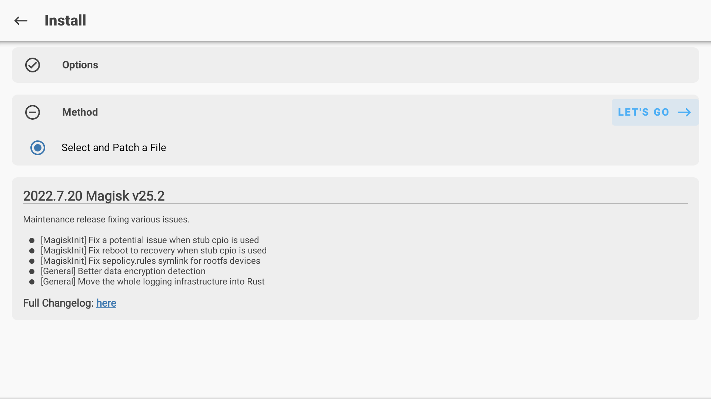
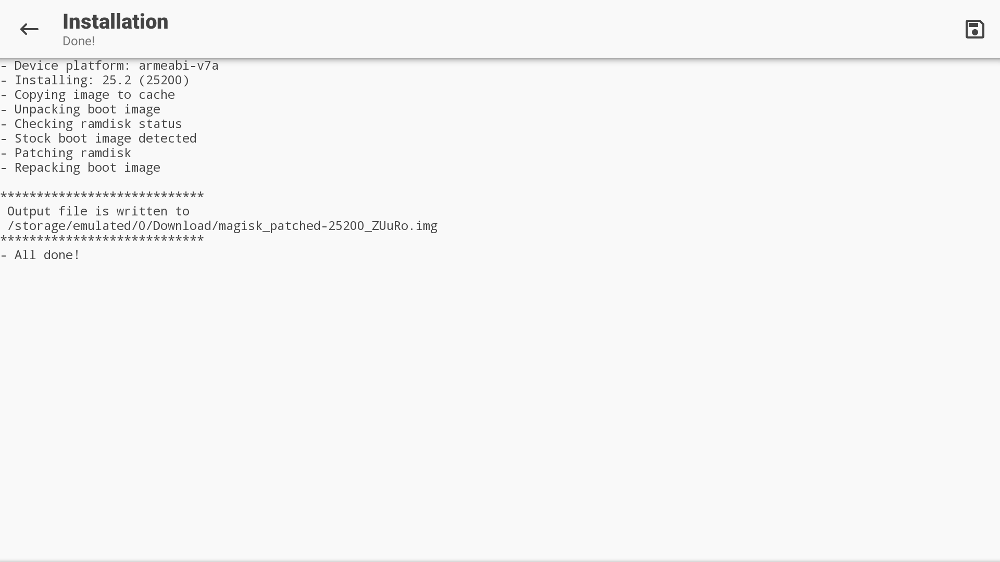

# Onn. 4k Streaming Box Rooting and Remote Button Remapping + Useful Android Tv Scripts

In this blog post we'll see how we can setup root access and remap remote buttons on `Onn. 4k Streaming Box`. 

## Disclaimer

<b>The content in this blog post is for educational purposes only. Use the content as per the regulations.</b> 


We will use following steps to setup `Onn. 4k Streaming box`. All the scripts mentioned in this post can be found on my GitHub repo -> [Onn. 4k Streaming Box Rooting and Remote Button Remapping](https://github.com/amit-raut/Onn.-4k-Streaming-Box-Rooting-and-Remote-Button-Remapping)

### Step 1: Perform initial setup with upgrade and Google sign-ng

Configure the Onn. 4k streaming device normally to setup remote and the initial Google sign-in. 

### Step 2: Enable Developer Option and USB debugging

Go to `Settings -> Device Preferences -> About -> Build` and press `Build` option 7 times and you should see pop-up message as "You are a developer". After enabling Developer option go to `Settings -> Device Preferences -> Developer Options` and enable `USB debugging`.

This should trigger a pop-up to allow USB debugging when the Onn. 4k streaming box is connected to a Linux system. Select always allow debugging option for the Linux system.

### Step 3: Use `Unlock-Bootloader.sh` script

When executed `Unlock-Bootloader.sh` script, the script will perform following actions:

Unlock the bootloader with adb commands
```adb reboot bootloader
fastboot devices
fastboot flashing unlock
fastboot reboot
```

### Step 4: Repeat Steps 1 and 2

Now the boot loader is unlocked repeat steps 1 and 2 to setup the Onn. 4k streaming box again. We'll work on getting root access next.

### Step 5: Setting up root 

Use the `Set-Root.sh` script. When script is executed it will perform following actions:

- Download the Onn. 4k Streaming box firmware from [https://download.ods.ninja/Android/firmware/dopinder/dopinder-qt.20210519-factory.zip](https://download.ods.ninja/Android/firmware/dopinder/dopinder-qt.20210519-factory.zip)
- Validate md5sum of the firmware with `08fa86ced3da6c50aafe8395fce27fe9`
- Extract the firmware to current working directory
- Download latest Magisk APK
- Push `boot.img` and `Magisk.apk` to Onn. 4k streaming box via `adb push`

### Step 6: Build custom boot.img with Magisk (Steps to be performed on Onn. 4k streaming box)

To build a custom boot.img file and get root perform following steps on Onn. 4k streaming box:

1. Install a file browser from `Play Store`
2. Open file browser and navigate to `/sdcard/Downloads/`
3. Install `Magisk.apk`
4. Open Magisk app 
   
5. Click on the `Install` button next to Magisk heading
   
6. Select the `/sdcard/Download/boot.img` in `Method` -> `Select and Patch a File` menu
   
7. Click `LET'S GO` button

Now we have the patched `boot.img` file stored in `/sdcard/Download/magisk_patched_*****.img`; we'll use it in our next step to obtain root access on Onn. 4k streaming box.




### Step 7: Getting root access 

Use the `Get-Root.sh` script. When script is executed it will perform following actions:

- Pull the patched `boot.img` file from Onn. 4k streaming box
- flash the Onn. 4k streaming box with patched image using following commands:
```
adb pull /sdcard/Download/$(adb shell ls /sdcard/Download/ | grep magisk_patch) ./magisk-boot.img
adb reboot bootloader
fastboot flash boot magisk-boot.img
fastboot reboot
```

Next the script will print output to let you know if root access is possible or not. 

### Step 8: Remap the Onn. 4k streaming box remote 

Use `Remap-Remote-Buttons.sh` script to remap the remote buttons. When script is executed it will perform following actions:

- Copies the `onntvremap` folder in to `/sdcard/Download`
- Moves the `onntvremap` folder to `/data/adb/modules/` directory as root user
- Reboot the device

Once the device comes back online. No button mapping will be present for the buttons like `YouTube`, `Netflix`, `Disney+`, `HBOMAX`. Install `Button Mapper` application from `Play Store`, grant superuser access to `Button Mapper` and remap the buttons on the remote as per your liking.

### Step 8: Remove bloatware from Onn. 4k streaming box

Onn. 4k streaming box contains following pre-installed apps:

1. YouTube TV
2. Disney Plus
3. HBO MAX
4. YouTube Music
5. HULU
6. Google Play Games
7. Default TV Launcher
8. Netflix (Can not be removed for some reason)

Run `Remove-Bloatware.sh` script to remove the pre-installed apps you do not need.

### Step 9: Install some useful apps

Use `Install-Useful-Apk.sh` to install the apps you like on your Android TV. Here are some useful apps for the android TV:

1. [SmartTubeNext](https://github.com/yuliskov/SmartTubeNext/releases/tag/14.96)


I hope you found these thing helpful. 

Enjoy~ :)

~ Amit Raut


